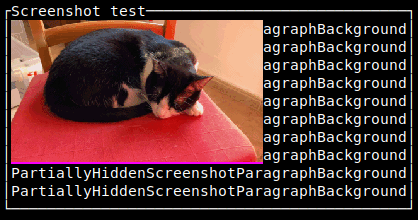

# ratatui-image

[](https://github.com/benjajaja/ratatui-image/actions?query=workflow%3A)

### Showcase:


Image widgets with multiple graphics protocol backends for [Ratatui]

**⚠️ THIS CRATE IS EXPERIMENTAL, AND THE `TERMWIZ` RATATUI BACKEND DOES NOT WORK**

Render images with graphics protocols in the terminal with [Ratatui].

## Quick start
```rust
use ratatui::{backend::{Backend, TestBackend}, Terminal, terminal::Frame, layout::Rect};
use ratatui_image::{
  picker::{Picker, ProtocolType},
  Resize, ResizeImage, protocol::{ImageSource, ResizeProtocol},
};

struct App {
    // We need to hold the render state.
    image: Box<dyn ResizeProtocol>,
}

fn main() -> Result<(), Box<dyn std::error::Error>> {
    let backend = TestBackend::new(80, 30);
    let mut terminal = Terminal::new(backend)?;

    // Should use Picker::from_termios(), but we can't put that here because that would break doctests!
    let mut picker = Picker::new((8, 12));
    picker.guess_protocol();

    let dyn_img = image::io::Reader::open("./assets/Ada.png")?.decode()?;
    let image = picker.new_resize_protocol(dyn_img);
    let mut app = App { image };

    // This would be your typical `loop {` in a real app:
    terminal.draw(|f| ui(f, &mut app))?;

    Ok(())
}

fn ui<B: Backend>(f: &mut Frame<B>, app: &mut App) {
    let image = ResizeImage::new(None);
    f.render_stateful_widget(image, f.size(), &mut app.image);
}
```

## Graphics protocols in terminals
Different terminals support different graphics protocols such as sixels,
kitty-graphics-protocol, or iTerm2-graphics-protocol. If no such protocol is supported, it is
still possible to render images with unicode "halfblocks" that have fore- and background color.

The [picker::Picker] helper is there to do all this graphics-protocol guessing, and also to map
character-cell-size to pixel size so that we can e.g. "fit" an image inside a desired
columns+rows bound etc.

## Widget choice
The [ResizeImage] widget adapts to its render area, is more robust against overdraw bugs and
artifacts, and plays nicer with some of the graphics protocols. However, frequent render area
resizes might affect performance.

The [FixedImage] widgets does not adapt to rendering area (except not drawing at all if space
is insufficient), is more bug prone (overdrawing or artifacts), and is not aligned with some of
the protocols. Its only upside is that it is stateless (in terms of ratatui), and thus is not
performance-impacted by render area resizes.

## Examples

See the [crate::picker::Picker] helper and [`examples/demo`](./examples/demo/main.rs).
The lib also includes a binary that renders an image file.

## Features
* `sixel` (default) compiles with libsixel.
* `rustix` (default) enables much better guessing of graphics protocols with `rustix::termios::tcgetattr`.
* `crossterm` or `termion` should match your ratatui backend. `termwiz` is available, but not
working correctly with ratatu-image.
* `serde` for `#[derive]`s on [picker::ProtocolType] for convenience, because it might be
useful to save it in some user configuration.

[Ratatui]: https://github.com/ratatui-org/ratatui
[Sixel]: https://en.wikipedia.org/wiki/Sixel

Current version: 0.3.4

Sixel compatibility and QA:

Terminal   | Fixed | Resize | Notes
-----------|-------|--------|-------
Xterm      | ✔️     | ✔️      |
Foot       | ✔️     | ✔️      |
kitty      | ✔️     | ✔️      |
Alacritty  | ✔️     | ❌     | [with sixel patch](https://github.com/microo8/alacritty-sixel), but never clears graphics.
iTerm2     | ❌    | ❌     | Unimplemented, has a protocolo [similar to sixel](https://iterm2.com/documentation-images.html)
konsole    | ❌    | ❌     | Does not clear graphics unless cells have a background style
Contour    | ❌    | ❌     | Text over graphics
Wezterm    | ❌    | ❌     | [Buggy](https://github.com/wez/wezterm/issues/217#issuecomment-1657075311)
ctx        | ❌    | ❌     | Buggy
Blackbox   | ❔    | ❔     | Untested

Latest Xterm testing screenshot:  


Halfblocks should work in all terminals.

### Comparison:

* [viuer](https://crates.io/crates/viuer)
  Renders graphics in different terminals/protocols, but "dumps" the image, making it difficult to
  work for TUI programs.
  The terminal protocol guessing code has been adapted to rustix, thus the author of viuer is
  included in the copyright notice.
* [yazi](https://github.com/sxyazi/yazi)
  Not a library but a terminal file manager that implementes many graphics protocols and lets you
  preview images in the filesystem.

License: MIT
